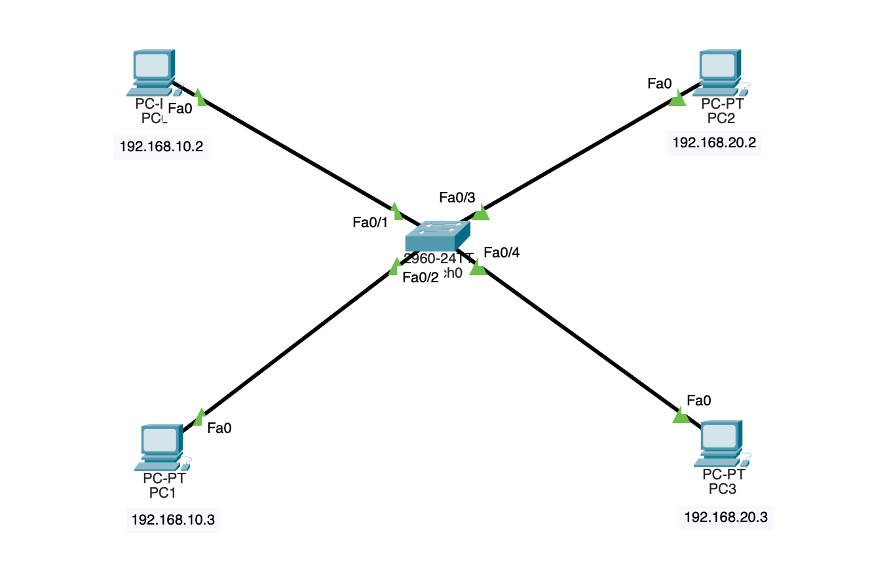
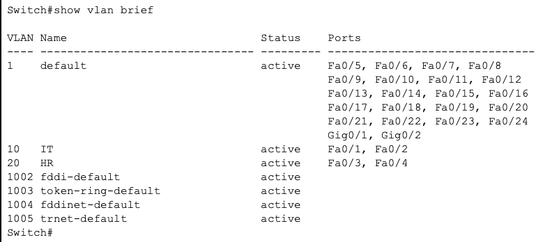
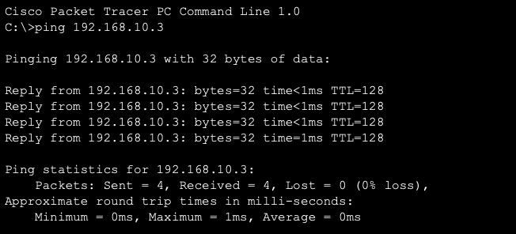
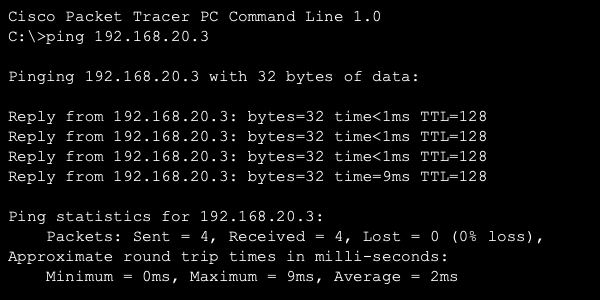
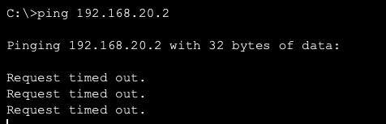

# CISCO-BASIC-VLAN-LAB

A basic Cisco Packet Tracer lab demonstrating VLAN configuration on a Cisco switch.

## Topology



## About This Lab

This lab demonstrates how Virtual Local Area Networks (VLANs) can be configured on a Cisco switch to logically separate devices into different broadcast domains. Devices within the same VLAN can communicate with each other, while communication between different VLANs is restricted without a Layer 3 device(router).

## Objective

Configure VLANs on a Cisco switch and verify network segmentation between different groups of devices.

## Devices Used in the Topology

- 1 Switch
- 4 PCs

## VLAN Configuration

| VLAN ID | VLAN Name | Assigned Devices |
| ------- | --------- | ---------------- |
| 10      | IT        | PC0, PC1         |
| 20      | HR        | PC2, PC3         |

## IP Addressing Scheme

| Device | IP Address   | Subnet Mask   | VLAN |
| ------ | ------------ | ------------- | ---- |
| PC0    | 192.168.10.2 | 255.255.255.0 | 10   |
| PC1    | 192.168.10.3 | 255.255.255.0 | 10   |
| PC2    | 192.168.20.2 | 255.255.255.0 | 20   |
| PC3    | 192.168.20.3 | 255.255.255.0 | 20   |

## Switch Configuration

### VLAN Creation

```bash
enable
configure terminal

vlan 10
name IT
exit

vlan 20
name HR
exit
```

### Port Assignment

```bash
interface range fa0/1-2
switchport mode access
switchport access vlan 10
exit

interface range fa0/3-4
switchport mode access
switchport access vlan 20
exit
```

## Verification

The VLAN configuration was verified using the following command:

```bash
show vlan brief
```

The output confirmed that the switch ports were correctly assigned to their respective VLANs.



### Connectivity Test

Communication was tested between devices in the same VLAN and between devices in different VLANs.

#### Successful Communication

- PC0 → PC1 (VLAN 10)
- PC2 → PC3 (VLAN 20)

Devices within the same VLAN successfully communicated with each other.





#### Failed Communication

- PC0 → PC2
- PC1 → PC3

Communication between different VLANs failed because no router or Layer 3 switch was configured to perform inter-VLAN routing.



## Result

VLANs were successfully configured on the switch. Devices within the same VLAN communicated successfully, while communication between different VLANs was restricted. This demonstrated how VLANs provide logical network segmentation and improve network organization and security.

## Tools Used

- Cisco Packet Tracer
- Cisco CLI